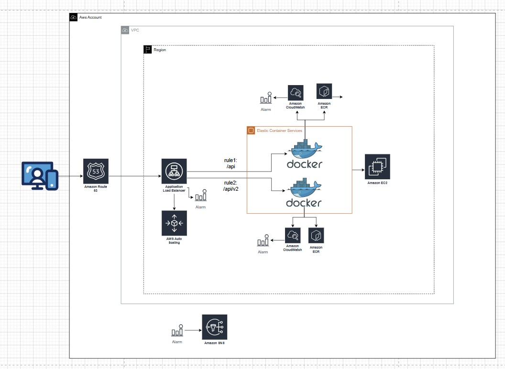

# 🏗️ Complete AWS infrastructure
Reference diagram: [`infrastructure-aws.jpg`](./infrastructure-aws.jpg).

## 🔎 What the diagram shows
- **🌐 Ingress and DNS:** traffic enters through **Amazon Route 53**. **AWS CloudTrail** records related API activity and logs can be stored in **Amazon S3** (account scope, outside the region box).
- **🛡️ Regional web tier:** an **Application Load Balancer (ALB)** receives traffic after **AWS WAF**, with WAF logs to **S3**; the ALB ties to **AWS Auto Scaling** and **alarms** for scaling and health.
- **🔀 Path-based routing:** the ALB applies path rules—for example **`/api`** to one container and **`/api/v2`** to another—so multiple API versions share the same load balancer.
- **📦 Containerized workload:** **Amazon ECS** runs **Docker** (with **EC2** as the typical compute layer for the cluster). Images are pulled from **Amazon ECR**; **Amazon Inspector** is tied into the image flow for assessment and vulnerability scanning.
- **📊 Observability:** **Amazon CloudWatch** collects metrics and logs from the containers, with **alarms** for operational monitoring.

Overall, the diagram highlights **security** (WAF, CloudTrail, Inspector, log storage in S3), **observability** (CloudWatch and alarms on the ALB and services), and a **containerized deployment** (Docker, ECS, ECR) with URL-based versioning.
