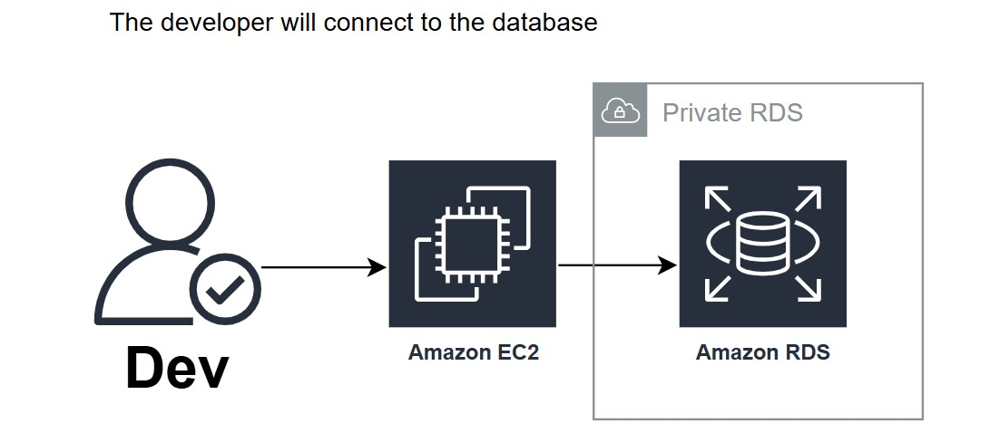
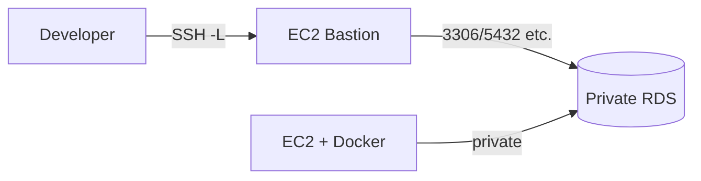

# 🏗️ EC2 (Docker), bastion, and private RDS
Reference architecture where **Amazon RDS** is not reachable from the internet—only from the VPC. Developers reach the database **over SSH**: first to the **bastion** (EC2), then via **local port forwarding** (`ssh -L …`) to the private RDS endpoint, without exposing the database to the public internet.

Reference diagram: [`diagram.jpg`](./diagram.jpg).

## 🔎 What the diagram shows
- **👤 Dev:** the developer opens an **SSH** session to the bastion and, on the same connection, **local port forwarding** to RDS (the SQL client targets `localhost` on the mapped port).
- **🖥️ Amazon EC2 (bastion):** intermediate instance; developer traffic enters only here (SSH/TCP 22 to the bastion, per your hardening).
- **🔒 “Private RDS” area:** box grouping the database on a private network (subnets without direct public internet access).
- **🗄️ Amazon RDS:** the engine inside that private zone; reachable only from the VPC (and from authorized hosts such as the bastion or the application EC2).

➡️ Flow summarized in the drawing: **Dev → EC2 (bastion) → Amazon RDS (private)**.

## 📋 Components
| Role | Service | Purpose |
| --- | --- | --- |
| **🐳 Application** | **EC2 + Docker** | Runs containers (for example API or workers) in the same VPC as RDS—the natural consumer of the database. |
| **🗄️ Database** | **Amazon RDS** | Relational engine in **private subnets**, no public IP (`Publicly accessible = No`). |
| **🔑 Operational access** | **EC2 bastion** (jump host) | **SSH only** from the developer machine; that session uses **`-L` (local forward)** to reach the RDS host and port inside the VPC. |

## 📡 Data flow
1. **📦 Application traffic:** containers on the application EC2 talk to RDS over the VPC private network (same CIDR / internal routing).
2. **🔐 Developer traffic (SSH):** there is no direct laptop → RDS connection. The path is **SSH to the bastion** and **local port forwarding** (`ssh -L local_port:rds-endpoint:db_port user@bastion`) so tools (psql, mysql, DBeaver, etc.) use `127.0.0.1:local_port` and the tunnel terminates on RDS.

## 🛡️ Why use a bastion
- **🗄️ Private RDS** shrinks attack surface: no public endpoint and no need to open the database security group to “the whole internet.”
- **🖥️ Bastion** concentrates human access over **SSH (22):** restrict the security group to known IPs/VPN ranges and audit sessions (CloudTrail, bastion logs, etc.).
- **🐳 Application EC2** does not need to expose the database; it only needs ingress/egress rules toward RDS on the engine port.

## 📝 Design notes (summary)

- **🌐 Subnets:** place **RDS and the Docker EC2** in **private subnets**; add NAT routes only if they need outbound internet (updates, external APIs). NAT is not required solely for RDS connectivity.
- **🛡️ Security groups:** RDS accepts traffic from the application SG and the bastion SG on the engine port; the bastion SG allows **inbound TCP 22** only from sources you define (office, static IP, corporate VPN CIDR, etc.).
- **🔀 Other access patterns (not this variant):** [Session Manager](https://docs.aws.amazon.com/systems-manager/latest/userguide/session-manager.html) port forwarding without exposing 22 to the internet, or **Client VPN** to be inside the VPC without an SSH bastion hop.
