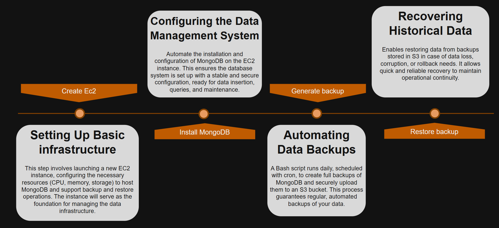
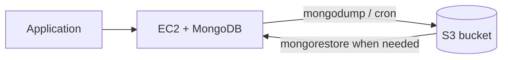

# 🍃 MongoDB on EC2 + S3 backups (instead of DocumentDB)
Pattern for running **MongoDB on Amazon EC2** when you want a **Mongo-compatible** datastore without **Amazon DocumentDB**—often driven by **cost**, existing **mongodump/mongorestore** tooling, or full control over version and tuning. **Backups and restore** are handled with **S3** and scripts (not DocumentDB automated backups).

> **Implementation repo (scripts & steps):** [**Aws.Ec2.MongoDB.WithBackups.S3**](https://github.com/agustinafassina/Aws.Ec2.MongoDB.WithBackups.S3) — install on EC2, `mongodump` → S3, restore with `mongorestore`, cron examples, logging and lock.

Reference diagram: [`diagram.png`](./diagram.png) (same asset as in the [implementation repo](https://github.com/agustinafassina/Aws.Ec2.MongoDB.WithBackups.S3/blob/main/diagram.png)).



## 🔎 What this architecture shows
- **🖥️ Amazon EC2:** hosts **MongoDB** (self-managed on Ubuntu in the implementation repo).
- **🍃 MongoDB:** application database on the instance EBS volume.
- **🪣 Amazon S3:** durable storage for backup archives (`mongodump`, optional `--gzip`).
- **🕒 Cron (on EC2):** scheduled backups (e.g. daily prod, weekly QA) invoking the backup script.

➡️ Flow: **EC2 (MongoDB) → mongodump → upload → S3**; restore path: **S3 → download → mongorestore on EC2**.



## 📋 DocumentDB vs MongoDB on EC2
| Criterion | **Amazon DocumentDB** | **MongoDB on EC2** (this pattern) |
| --- | --- | --- |
| **Ops model** | Fully managed AWS service | You manage OS, MongoDB, patches, monitoring |
| **Cost** | Higher at steady scale for some workloads | Often **lower** if you accept ops trade-offs (`t3.small` + EBS + S3) |
| **Compatibility** | MongoDB **API** (not 100% feature parity) | **Native** MongoDB version you install |
| **Backups** | AWS-managed snapshots / PITR | **Your scripts** → S3 (`mongodump`), lifecycle rules on bucket |
| **HA / failover** | Multi-AZ clusters, AWS handles | You design (replica set, second AZ, etc.)—not in the starter scripts |
| **Best for** | Production with minimal ops, AWS support path | Cost-sensitive, known Mongo ops, existing dump/restore playbooks |

**Use EC2 + MongoDB when** you consciously trade managed service benefits for **cost and control**, and you commit to **backup/restore runbooks** (covered in the linked repo).

**Prefer DocumentDB when** you need managed HA, AWS integration, and less day-2 toil on the database engine.

## 🚀 Typical workflow (implementation repo)
All steps, scripts, and folder READMEs live in [**Aws.Ec2.MongoDB.WithBackups.S3**](https://github.com/agustinafassina/Aws.Ec2.MongoDB.WithBackups.S3).

| Step | Folder in implementation repo | Action |
| --- | --- | --- |
| 1 | — | Create **EC2** (min. **`t3.small`**, **30 GB** volume recommended). |
| 2 | [`1.InstallMongoDB.Ec2`](https://github.com/agustinafassina/Aws.Ec2.MongoDB.WithBackups.S3/tree/main/1.InstallMongoDB.Ec2) | Install MongoDB on Ubuntu. |
| 3 | [`2.GenerateBackup`](https://github.com/agustinafassina/Aws.Ec2.MongoDB.WithBackups.S3/tree/main/2.GenerateBackup) | Configure S3 bucket, backup script (`mongodump`, logging, lock, `--gzip`), **cron**. |
| 4 | [`3.RestoreBackup`](https://github.com/agustinafassina/Aws.Ec2.MongoDB.WithBackups.S3/tree/main/3.RestoreBackup) | Download from S3 and **mongorestore** when needed. |

### 🕒 Cron examples (from implementation repo)
**Production (daily, 5:00 AM):**

```cron
0 5 * * * /home/ubuntu/generate-backup.sh --gzip >> /var/log/mongodb-backup.log 2>&1
```

**QA (weekly, Friday 5:00 AM):**

```cron
0 5 * * 5 /home/ubuntu/generate-backup.sh --gzip >> /var/log/mongodb-backup.log 2>&1
```

Adjust the script path to match your deployment. Details: [`2.GenerateBackup/README.md`](https://github.com/agustinafassina/Aws.Ec2.MongoDB.WithBackups.S3/tree/main/2.GenerateBackup).

## 🛡️ Design notes (summary)
- **🔐 IAM instance profile:** EC2 role with least privilege to **write/read** the backup bucket only (no static keys on disk if avoidable).
- **🪣 S3:** enable **versioning** and **lifecycle** (IA/Glacier) for old dumps; block public access.
- **🔒 Security groups:** MongoDB port only from app tier or bastion—not open to `0.0.0.0/0`.
- **📊 Monitoring:** disk space on EBS, backup job logs (`/var/log/mongodb-backup.log`), S3 upload failures.
- **🧪 Restore drills:** periodically test **3.RestoreBackup** on a non-prod instance.
- **⚠️ Single instance:** this starter pattern is **not** multi-AZ HA; plan replica set or DocumentDB if RTO/RPO require it.

## 📚 References
- **Implementation:** [agustinafassina/Aws.Ec2.MongoDB.WithBackups.S3](https://github.com/agustinafassina/Aws.Ec2.MongoDB.WithBackups.S3)
- [Amazon DocumentDB](https://docs.aws.amazon.com/documentdb/latest/developerguide/what-is.html)
- [Amazon S3](https://docs.aws.amazon.com/AmazonS3/latest/userguide/Welcome.html)
- [MongoDB backup methods](https://www.mongodb.com/docs/manual/core/backups/)
