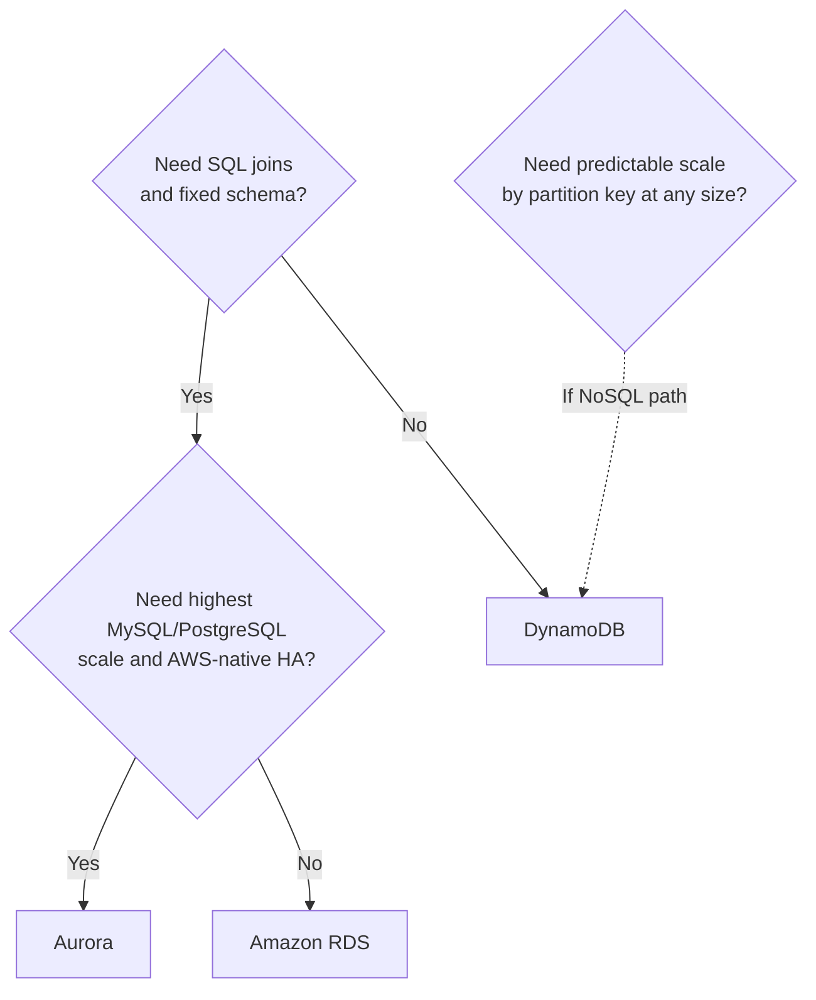

# 🗄️ RDS vs Aurora vs DynamoDB — when to use each
Short **decision guide** for choosing a primary data store on AWS. All three are managed; the split is **relational SQL** (RDS / Aurora) vs **NoSQL key-value/document** (DynamoDB).

> **Not covered here:** Redis (ElastiCache), OpenSearch, Timestream, or “lift Oracle/SQL Server as-is” sizing. For **MongoDB API** workloads, compare **DocumentDB** vs **MongoDB on EC2** in [`ec2-mongodb-s3-backups/`](../ec2-mongodb-s3-backups/).

## ⚡ Quick pick

| If you need… | Lean toward |
| --- | --- |
| Standard **MySQL / PostgreSQL / MariaDB** app, moderate scale, familiar ops | **RDS** |
| Same engines, **more throughput**, faster failover, **read replicas**, growth headroom | **Aurora** |
| **Access by key** (and sort key), flexible item shape, **massive** scale, ms latency at scale | **DynamoDB** |

## 📊 Decision table
| Criterion | **Amazon RDS** | **Amazon Aurora** | **Amazon DynamoDB** |
| --- | --- | --- | --- |
| **Model** | Relational (SQL) | Relational (SQL), MySQL & PostgreSQL compatible | NoSQL (key-value; optional GSIs) |
| **Schema** | Fixed tables, migrations | Same as RDS | Schemaless per item; design around **access patterns** |
| **Queries** | Full SQL, ad hoc joins | Full SQL (PostgreSQL/MySQL), ad hoc joins | **GetItem / Query / Scan** (Scan sparingly) |
| **Scale-up pattern** | Bigger instance class | Bigger instance + **Aurora storage** auto-grows | **On-demand** or provisioned **RCU/WCU** |
| **Read scaling** | Read replicas (engine-dependent) | **Aurora replicas** (low lag), reader endpoints | **DAX** (cache), GSIs, parallel scans (careful) |
| **HA / failover** | Multi-AZ (minutes failover typical) | **Storage across AZs**, faster failover vs RDS | **Multi-AZ** tables, global tables (multi-region) |
| **Typical app fit** | CRUD apps, reports, ERP-style, small–mid traffic | Same, but **production** with stricter uptime/IO | Sessions, carts, IoT, gaming state, event idempotency |
| **Connections** | Many clients, connection pooling often required | Same; **RDS Proxy** common with Aurora | **HTTP API** (no traditional connection pool) |
| **Cost profile** | Often **lowest** for small/steady SQL | Higher base; can win at **sustained high** SQL load | Pay per request/storage; cheap at spiky/low if designed well |
| **Ops familiarity** | Highest (classic RDBMS) | High (still SQL, Aurora-specific tuning) | **Data modeling** learning curve |

## ✅ Choose **RDS** when
- Workload is **MySQL, PostgreSQL, MariaDB, Oracle, or SQL Server** and size is **small to medium**.
- Team wants the **simplest** managed SQL with minimal Aurora-specific concepts.
- **Multi-AZ** and backups are enough; sub-minute failover is not a hard requirement.
- Budget is tight and instance rightsizing is acceptable.

## ✅ Choose **Aurora** when
- You stay on **Aurora MySQL or Aurora PostgreSQL** and need **higher** read/write throughput than a single RDS instance comfortably gives.
- You want **more replicas** with lower replication lag and a **cluster endpoint** model.
- **Fast failover** and storage that **grows automatically** matter for production.
- You may use **Aurora Serverless v2** for variable SQL load (still relational).

## ✅ Choose **DynamoDB** when
- Access is **key-based** (partition key + optional sort key); you can list queries up front.
- You need **horizontal scale** without managing database servers.
- Traffic is **spiky** or **unpredictable** and on-demand fits (with good key design).
- You want **single-digit ms** at scale for known patterns—not arbitrary ad hoc SQL reports.

## 🚫 Avoid (common mismatches)
| Choice | Poor fit because |
| --- | --- |
| **DynamoDB** | Heavy **joins**, ad hoc reporting, constantly changing query shapes without GSIs |
| **RDS** | **Internet-scale** write throughput on one node without sharding strategy elsewhere |
| **Aurora** | Tiny dev DB where **RDS micro** is enough—paying for Aurora features you do not use |
| **Any SQL** | Treating DynamoDB like a relational DB “with a flexible schema” and **Scan**-ing everything |

## 🔀 RDS vs Aurora (both SQL)
| Question | RDS | Aurora |
| --- | --- | --- |
| Same app code (Postgres/MySQL)? | ✅ | ✅ (compatible engines) |
| Default for new **small** project? | ✅ Often | Optional |
| **Many read replicas**, analytics readers? | Limited by engine | ✅ Strong |
| **Global** low-latency SQL writes in multiple regions? | Complex (custom) | **Aurora Global Database** (specific use case) |

## 🔗 Related in this repo
- [`ec2-bastion-and-private-rds/`](../ec2-bastion-and-private-rds/) — private **RDS** access pattern (bastion + SSH).

## 📚 AWS documentation
- [Amazon RDS](https://docs.aws.amazon.com/AmazonRDS/latest/UserGuide/Welcome.html)
- [Amazon Aurora](https://docs.aws.amazon.com/AmazonRDS/latest/AuroraUserGuide/CHAP_AuroraOverview.html)
- [Amazon DynamoDB](https://docs.aws.amazon.com/amazondynamodb/latest/developerguide/Introduction.html)
- [DynamoDB best practices](https://docs.aws.amazon.com/amazondynamodb/latest/developerguide/best-practices.html)